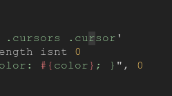

# block-cursor

Changes the I-bar cursor to a block cursor.

## config

By default, the color will use your current syntax theme's `@syntax-cursor-color`. This can be overridden by a color specified in the package's settings. Also cursor blinking can be enabled/disabled.